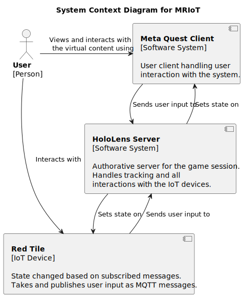
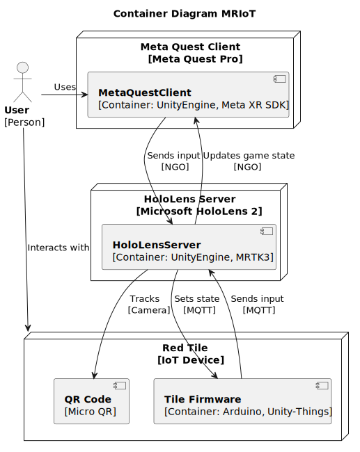
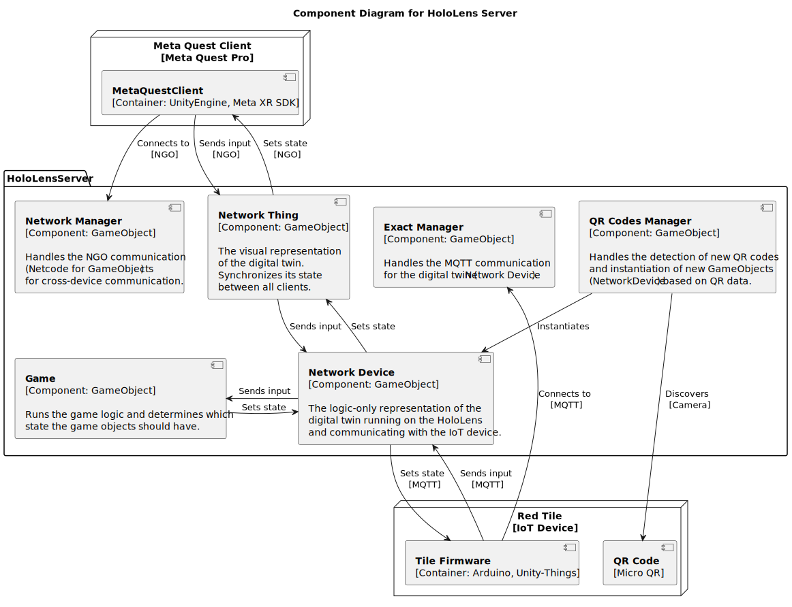
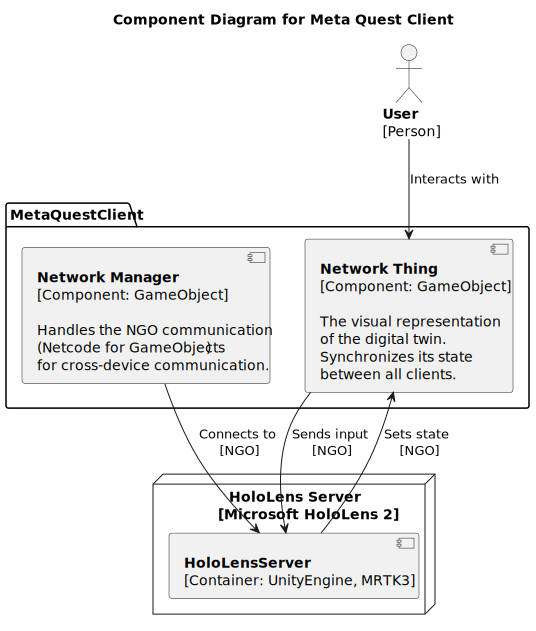
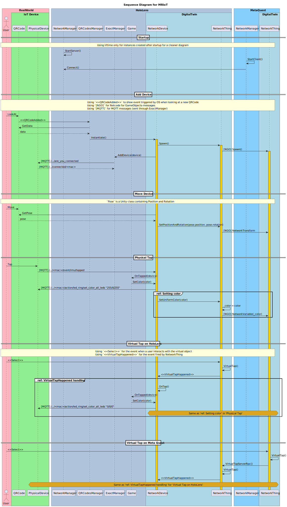

# Diagrams

> __NB:__ These diagrams are compiled from PlantUML.
>   It is therefore important to export when changing the `.puml`-files.
>
>   This is done by
>   1. Open the `/docs` directory in VSCode (as project root)
>   2. If necessary, install the extension `jebbs.plantuml`
>   3. Run the command `plantuml.exportWorkspace` (_PlantUML: Export Workspace Diagrams_)
>   4. Select `svg` for file format

## Table of Contents

- [Context Diagram](#context-diagram)
    - [Container Diagram](#container-diagram)
        - [Component Diagram: Holo Lens Server](#component-diagram-hololens-server)
        - [Component Diagram: Meta Quest Client](#component-diagram-meta-quest-client)
- [Sequence Diagram](#sequence-diagram)

## Context Diagram

## Container Diagram

## Component Diagram: HoloLens Server

## Component Diagram: Meta Quest Client

## Sequence Diagram

